# Signature autumn delicacies in Hanoi

**As summer fades away, Hanoi enters autumn, the best season of the year with many delicacies to enjoy.**

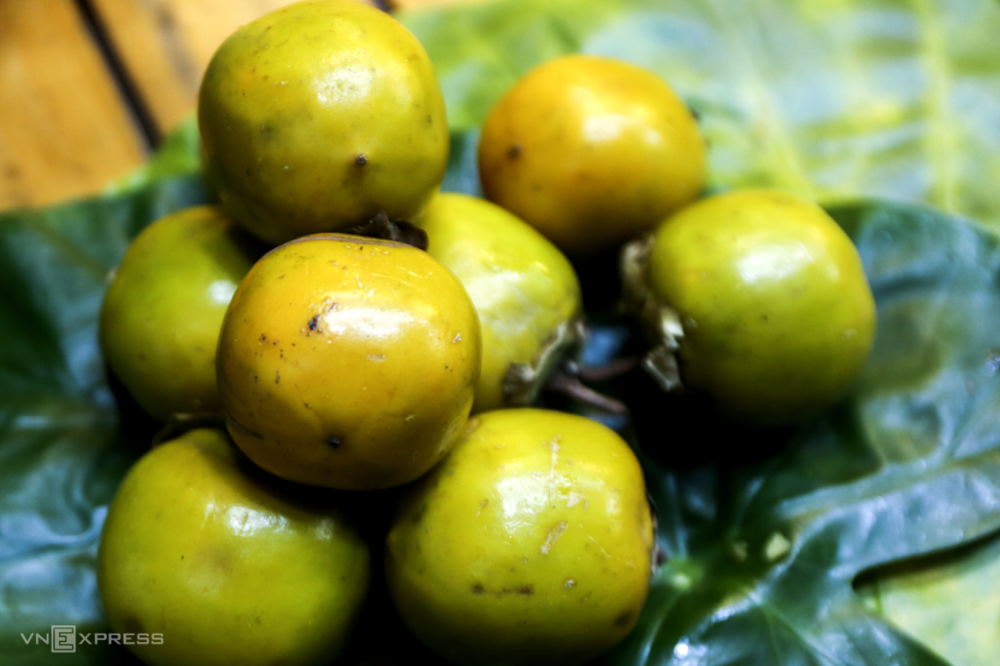

**Hanoi** is experiencing its most beautiful days. Comfortable weather, mild sunshine, suitable for strolling, sightseeing and outdoor photography. Besides the fragrant milk flowers and beautiful scenery, Hanoi also offers special and unique delicacies that visitors must try during autumn.

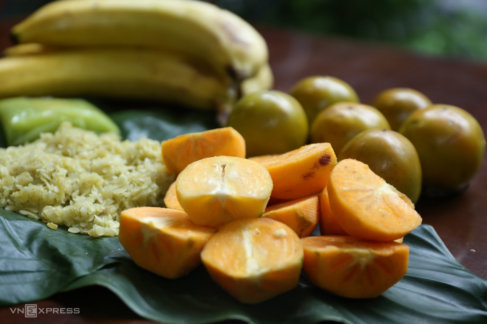

Persimmons can be considered one of the most signature delicacies during fall in **Hanoi**. In fact, persimmons are not grown in **Hanoi** but in northern provinces like **Cao Bang**, **Lang Son** and **Lao Cai**. Every autumn, this fruit is sold across the capital. Persimmons must not be too ripe, have a yellow and green color, seedless and soaked in water before eating.

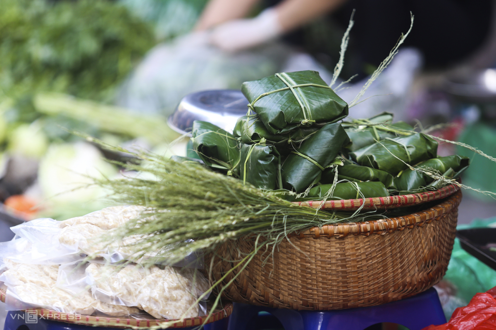

From **September**, when summer starts fading, **Hanoians** begin to harvest and make green rice flakes, which is sold by street vendors in the capital. This autumn gift is carefully wrapped in lotus leaves. It’s a tradition for **Hanoians** to buy green rice flakes in autumn.

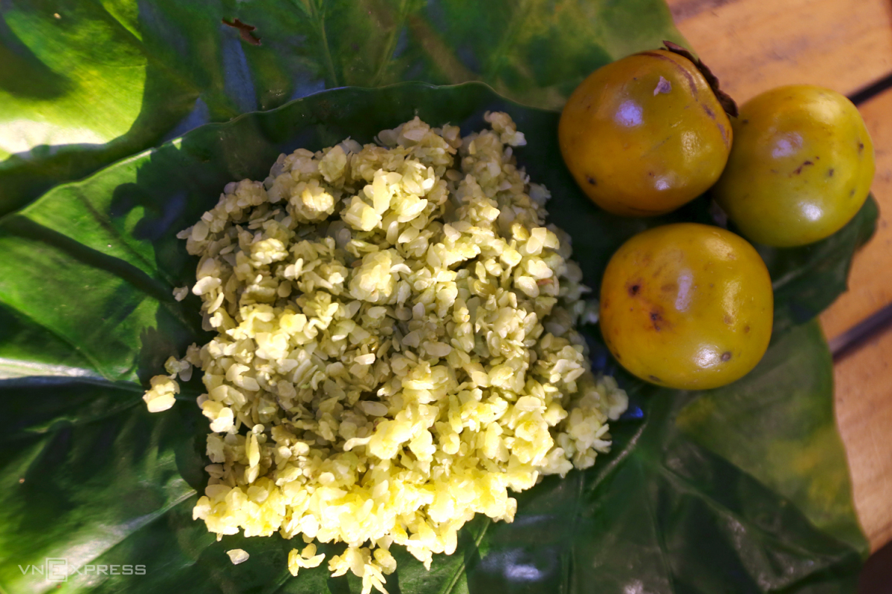

Green rice flakes also appear in dishes like **Vietnamese** sausage, sweet soup and sticky rice. Fresh green rice flakes are often eaten with ripe bananas.

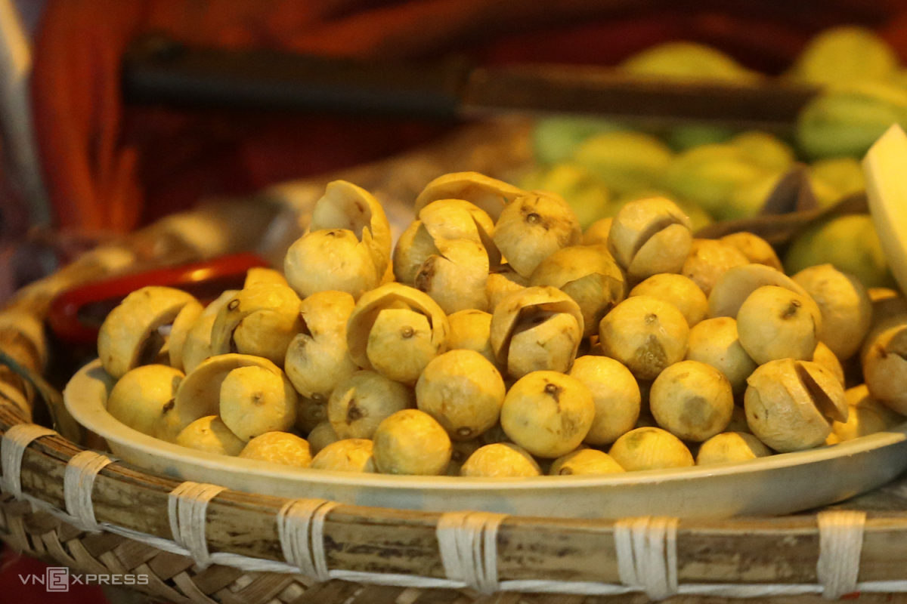

Speaking of autumn delicacies in **Hanoi**, it is impossible not to mention dracontomelon. Ripe dracontomelons are found on the street throughout the **Old Quarter** in late summer and early fall. If green and sour dracontomelons are used for soup and braised duck, ripe and yellow dracontomelons have a lightly sweet taste and are a favorite snack of many.

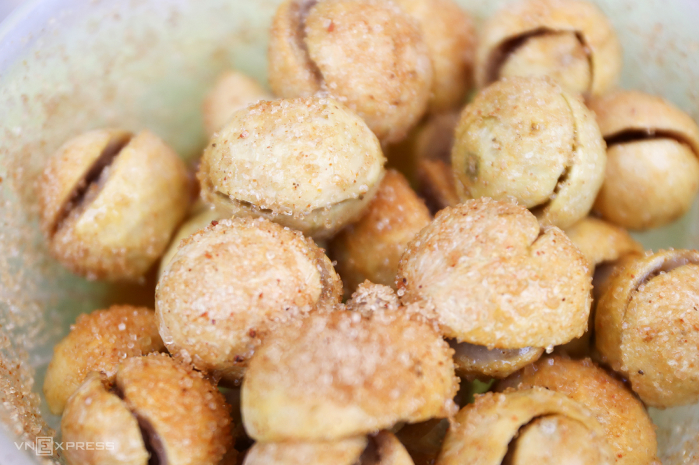

The most popular autumn dish made from ripe dracontomelons is sweetened dracontomelons. Some people even enjoy raw and peeled dracontomelons with salt. Their sour taste is what many people remember when thinking about fall in **Hanoi**.

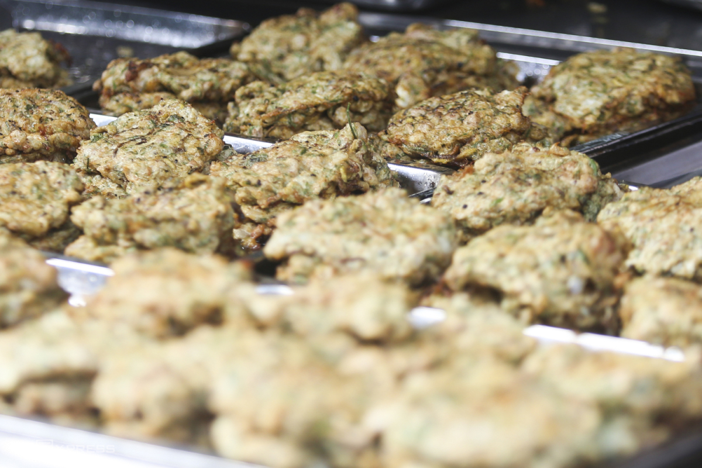

**Ragworm** is a unique autumn dish in **Hanoi**. The species live underwater and are rich in protein. **Ragworm** can be processed into many different dishes, of which _cha ruoi_ is the most popular in **Ragworm**. This dish is made from deep fried ragworm with ground meat, eggs, tangerine peel and dill. It’s served with vermicelli, raw vegetables, sweet and sour fish sauce.

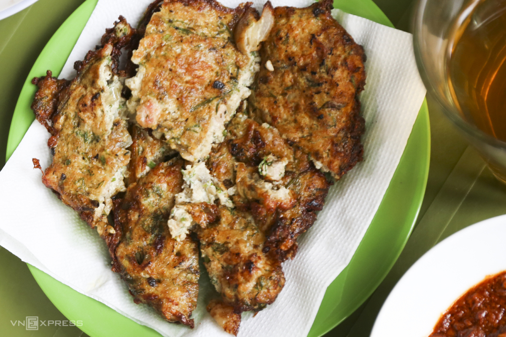

In **Ragworm**, _cha ruoi_ is sold all year round, but that from the ninth to eleventh months of the lunar calendar is considered by many to be the most delicious since it is the breeding season of ragworms. Diners can find _cha ruoi_ at **O ​​Quan Chuong**, **Lo Duc** and **Hang Be**.

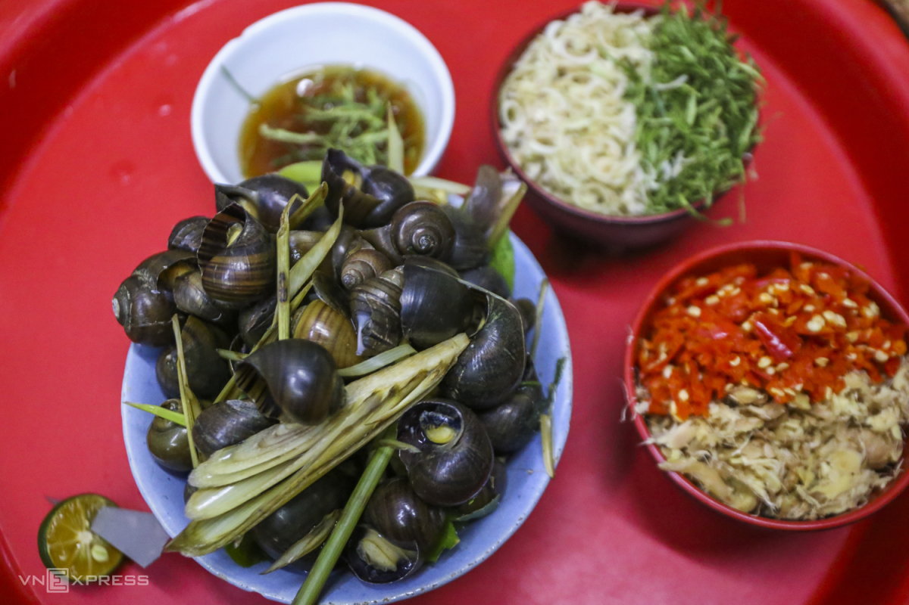

There are also other dishes available all year round, but when the weather gets colder, **Hanoians** will immediately think of them, and hot boiled snails.

Eating a bowl of hot and steaming boiled snails by the sidewalk is a way to enjoy autumn in **Hanoi**. The snails are boiled with lemongrass, ginger and lime leaves, boasting a special aroma. The dipping is fish sauce mixed with chili and ginger. This is also a key part that makes the dish shine.

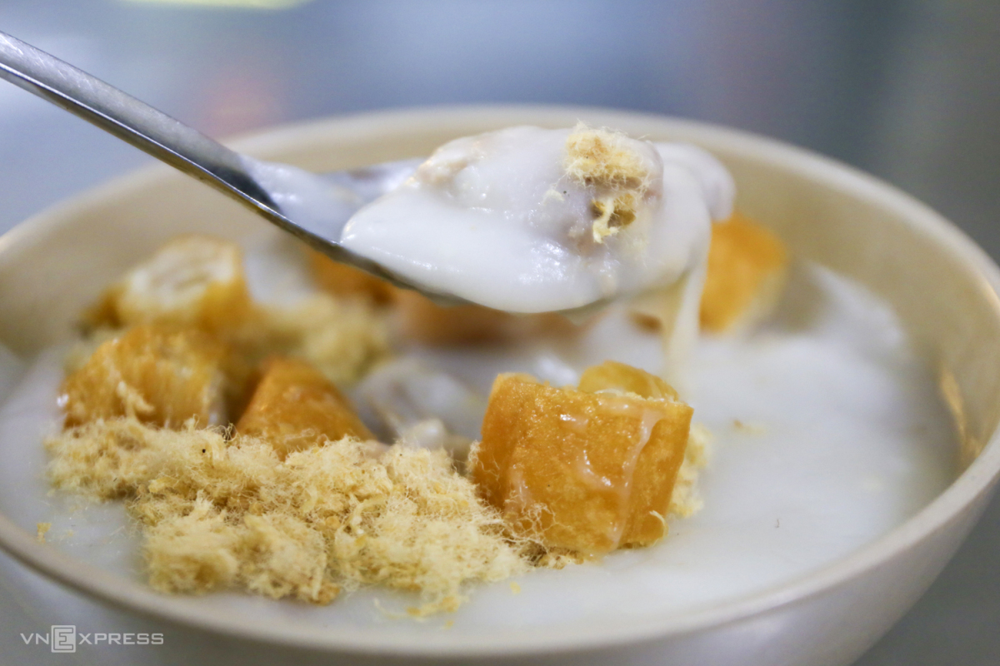

Rib porridge can be found in the **Old Quarter** and **Dong Xuan Market**. The texture is really smooth and silky. Cartilage and ribs are cooked well and added to the porridge, and sometimes, served with quails and shrimp to add more flavor.

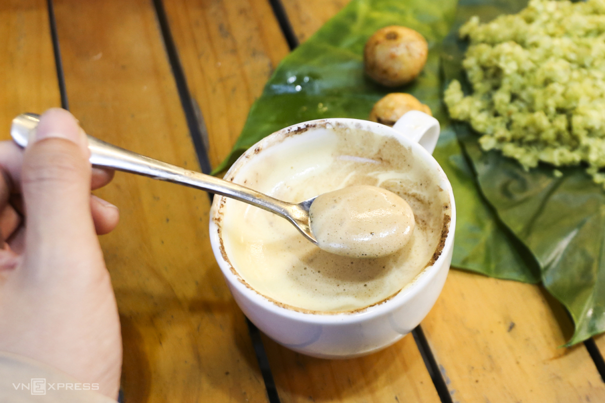

**Egg coffee** is a favorite choice for autumn conversations and meetings. The rich taste of eggs with the warm, aromatic flavor of coffee create a signature **Hanoi** drink. Enjoying **egg coffee** in an old cafe, reading a book or watching the flow of life on the streets will make autumn complete.